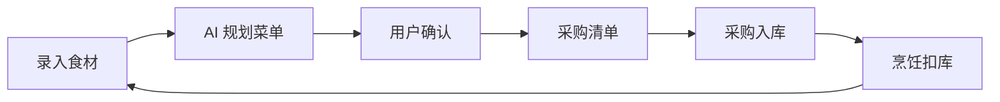
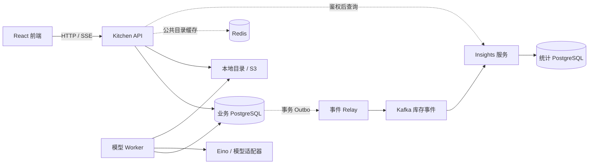

# FoodFlow 食光

**家庭食材管理与 AI 膳食规划平台**

当前版本：**v0.2.0** · [更新日志](CHANGELOG.md)。版本号同步记录于前端包与 OpenAPI 文档，个人中心可查看当前前端版本。

[](https://github.com/link1ks/FoodFlow/actions/workflows/ci.yml)

FoodFlow 将家庭库存、菜单、采购与烹饪记录连接成完整流程。模型基于真实库存提出建议，用户确认后由 Go 业务服务执行数量计算与库存变更。



## 功能

| 模块 | 功能 |
| --- | --- |
| 今天 | 按待办展示待确认结果、临期食材、今日菜单与采购事项；新手指南可收起 |
| 账号与家庭 | 手机号 / 邮箱密码登录、已验证手机号找回/换绑、互补账号合并、会话撤销、成员邀请与角色权限 |
| 食材库存 | 图文选择、名称与别名搜索、多批次、临期提醒、报损与纠偏 |
| 安排菜单 | 16 道家庭菜谱、原料/步骤预览、缺口分析、多菜组合、跨餐次规划与人工确认 |
| 厨房记录 | 批次可食重量确认、营养估算、金额月报与分页 PNG、食材用量、最近 100 条流水与生成记录 |
| 共享采购 | 协同清单、采购项删除、幂等入库与安全库存补货 |
| 烹饪管理 | 多菜备餐时间轴、厨房专注模式、步骤打卡、按餐次扣库与不可变流水 |
| 调味品 | 已有批次启用免称重、瓶装余量显示、滑动校准与低水位补货 |
| 官方价格 | 37 城市选择，展示官方监测价格、规格、来源与日期 |
| 食材用量 | 按月份查看买入、消耗与报损数量，独立统计服务异步汇总；未启用与临时故障分别提示 |

食材目录包含 **91 种食材**，其中 **79 种**提供 USDA SR Legacy 营养参考值，按每 100 克可食部展示。

[家庭试用指南](docs/FAMILY_TRIAL.md) 提供双人协作、厨房闭环、数据备份与反馈记录。独立本机部署默认关闭收费模型与短信，见 [部署说明](docs/LEARNING_DEPLOYMENT.md)；真实模型需另外配置并明确授权，API 调用按服务商账单计费。

## 架构与技术栈

核心业务采用 **Go 模块化单体 API + 独立 Worker**，库存写入保留在同一 PostgreSQL 事务边界内。可选平台扩展引入公共目录缓存、库存事件与独立统计服务，统计服务拥有自己的数据库。

| 层次 | 技术 |
| --- | --- |
| 前端 | React、TypeScript、Vite、Tailwind CSS、Radix |
| 状态管理 | TanStack Query、Zustand |
| API 与任务 | Go、Gin、OpenAPI、PostgreSQL 任务队列、SSE |
| 数据层 | PostgreSQL、pgx、sqlc、goose |
| Agent | Eino、Chat Completions 兼容适配器、结构化输出校验 |
| 存储与部署 | 本地目录 / S3、Docker Compose、GitHub Actions |
| 测试 | Go testing、Testcontainers、Vitest、Playwright |
| 可选平台扩展 | Redis、Kafka / franz-go、独立 Insights 服务 |
| 工程反馈 | 仓库导航、AST 架构检查、隔离验收与 JSON 证据 harness |



### 关键设计

| 关注点 | 实现方式 |
| --- | --- |
| 家庭权限隔离 | 服务端校验家庭成员身份与角色，Agent 工具沿用业务权限边界 |
| 库存一致性 | 批次行锁、条件更新与非负约束；库存、不可变流水及 Outbox 在同一事务提交，扣减不足时整体回滚 |
| 幂等与审计 | 幂等键绑定请求摘要；库存纠正追加补偿流水，保留历史变动 |
| 精确计量 | 数量精度 0.001，份数缩放向上舍入；仅在同一计量维度内换算 |
| 批次分配 | 按最早到期优先（FEFO）跨批次扣减，执行时重新校验可用库存 |
| 菜谱调度 | 多字位集与 `math/bits` 匹配原料，到期小顶堆与有界组合搜索检测多菜资源冲突 |
| 备餐与跨餐规划 | 内存 DAG 设备约束调度；多餐库存结转、临期优先及组合搜索预算 |
| 历史统计 | 完成餐次保存份数、原料营养与成本快照；营养查询使用 PostgreSQL 聚合及窗口函数 |
| Agent 执行 | 结构化输出校验、调用预算和超时控制；模型提出方案，业务代码计算数量，库存写入需用户确认 |
| 后台任务 | `FOR UPDATE SKIP LOCKED` 并发领取、租约续期及过期恢复；有效租约与取消状态共同约束结果写入 |
| 会话与验证码 | JWT 配合服务端会话撤销；验证码采用 HMAC、用途隔离、限流与单次消费 |
| 缓存降级 | Redis 仅缓存公共目录；超时或不可用时回源，权限与库存以 PostgreSQL 为准 |
| 事件可靠性 | Outbox 至少一次投递；稳定事件 ID、统计服务 Inbox 去重、非法事件隔离，提交数据库后再提交消费位点 |

菜单推荐不预留库存。SSE 断线后重新读取服务端状态；可能产生费用的模型调用失败后由用户手动重试。独立统计是最终一致的读取结果，不参与库存扣减。

## 快速启动

依赖：Docker Compose。开发与验证另需 Go 1.26、Node.js 24、pnpm 11；平台验收脚本需要 PowerShell 7（`pwsh`）。

### 下载一次，后续更新

每台电脑首次使用 Git 下载一次项目，以后只需拉取新增提交，无需重新下载整个项目。需要安装 [Git](https://git-scm.com/downloads)。

```powershell
# 首次下载，目录可按需修改
git clone https://github.com/link1ks/FoodFlow.git E:\FoodFlow
cd E:\FoodFlow
```

以后在已有项目目录中更新：

```powershell
cd E:\FoodFlow
git status --short
git pull --ff-only
```

更新前先提交或移走需要保留的本地修改。`--ff-only` 在本地与远端提交发生分叉时会停止，需自行处理分支差异。使用 GitHub 的 **Download ZIP** 得到的文件夹不包含 Git 更新记录，需要先用 `git clone` 建立可更新的项目。

源码更新后，运行中的 Docker 服务仍需重新构建。默认 `compose.yaml` 部署在备份数据库和照片后执行：

```powershell
docker compose up --build -d --wait --wait-timeout 180
docker compose ps
```

继续使用原项目目录、配置和数据卷；不要用删除数据卷的方式更新。自定义 Compose、试用和学习环境应沿用原部署方式，学习环境见 [发布与回退流程](docs/LEARNING_RELEASE.md)。数据库迁移可能改变结构，代码回退不等于数据库回退。

Windows 一键更新入口（`update.cmd`、`check-update.cmd`）目前已在本地实现，尚未发布到此仓库；发布前请使用上述 Git 命令。

多电脑更新同步的是**代码**。每台独立部署的账号、库存和照片不会自动同步；若需要共享同一家庭数据，应访问同一个部署，或按 [配套备份恢复](docs/BACKUP_RECOVERY.md) 迁移数据库与照片。只有提交并推送到 GitHub 的代码，其他电脑才能获取。

### Docker Compose

1. 将 `.env.example` 复制为 `.env`。

2. 在 `.env` 中设置至少 32 字节的随机 `JWT_SECRET`，可用以下命令生成：

   ```bash
   node -e "console.log(require('crypto').randomBytes(48).toString('base64'))"
   ```

3. 启动服务，自动执行迁移与种子数据导入：

   ```bash
   docker compose up --build -d
   docker compose ps
   ```

| 服务 | 地址 |
| --- | --- |
| 前端 | `http://localhost:5173` |
| API | `http://localhost:8080/api` |
| 健康检查 | `/health/live`、`/health/ready`（API 服务） |
| 指标 | `http://localhost:8080/metrics` |

注册后创建家庭即可使用。未配置模型时，界面明确显示演示模式。

### 可选集成

| 配置 | 说明 |
| --- | --- |
| `MODEL_ENDPOINT`、`MODEL_NAME`、`MODEL_API_KEY` | 文字模型，可接入 DeepSeek 等兼容服务 |
| `VISION_MODEL_NAME` | 视觉模型，可单独配置端点与密钥，需服务商支持图片输入 |
| `SMS_PROVIDER=aliyun` | 需 AccessKey、已审核签名及验证码模板 |
| `STORAGE_BACKEND` | `local` 或 `s3`；S3 需配置端点、区域、桶和凭证 |
| `MARKET_PRICE_SYNC=true` | Worker 启动及每 6 小时同步官方价格 |

完整配置见 [.env.example](.env.example)。环境变量优先于 `.env`，修改后需重启。短信未配置时可使用邮箱注册与密码登录。

### Redis / Kafka 平台验收

```powershell
pwsh -File scripts/local-acceptance.ps1 up
pwsh -File scripts/platform-acceptance.ps1
```

此流程在独立验收环境中叠加 `compose.platform.yaml`，页面地址为 `http://127.0.0.1:15173`。验收环境与 5173 开发环境的数据库、账号独立；服务边界与恢复方式见 [平台说明](docs/PLATFORM.md)。

## 工程 Harness 与验证

Harness 将仓库导航、架构约束、源码清单、测试、运行诊断和任务证据连接为可重复执行的流程。

```bash
# 安装前端依赖与验收浏览器
pnpm --dir web install --frozen-lockfile
pnpm --dir web exec playwright install chromium

# 静态约束、必需的数据库集成测试、前端测试与构建
go run ./cmd/harness -mode full

# 隔离部署、平台故障恢复、厨房主流程与桌面 / 手机浏览器
go run ./cmd/harness -mode acceptance

# 健康、队列、消费延迟与脱敏日志诊断
go run ./cmd/harness -mode diagnose
```

Docker 必须可用。`full` 不允许通过跳过数据库集成测试获得成功；测试不使用生产模型凭证。结果保存在 `.cache/harness`，包含代码摘要、运行环境及各项检查结果。

架构检查约束纯算法与服务边界；[生成清单](docs/generated/contracts.md) 检查接口、配置及事件契约是否过期。任务完成记录必须引用当前代码的完整验证报告，运行期间修改源码会被拒绝。详见 [Harness 工作流](docs/HARNESS.md)。

### 已验证范围

本地完整验证与隔离验收覆盖数据库、浏览器与平台恢复；验证范围和限制随提交记录。最新云端结果查看 [GitHub Actions](https://github.com/link1ks/FoodFlow/actions/workflows/ci.yml)，本地发布准备、配套备份与同版本重建证据见 [阶段记录](docs/exec-plans/learning-release.md)。运行中或旧版本的 CI 不代表当前版本已通过。

| 范围 | 验证内容 |
| --- | --- |
| 库存与权限 | 并发扣减、重复入库、跨家庭拒绝、单位约束、份数缩放 |
| 后台任务与 Agent | 租约恢复、旧 Worker 写入拦截、取消与确认边界、确定性模型测试 |
| 业务统计 | 家庭营养快照、份数折算、日期窗口与缺失数据；调味品扣减、校准与补货 |
| 平台恢复 | Redis 失效回源、Kafka 中断期间业务写入、消费恢复与去重、非法事件隔离 |
| 网关与页面 | API 地址变化后网关恢复；前端单元测试、桌面 / 手机 Chromium 验收，包含完整厨房链路、家庭切换和照片回退 |
| 云端质量门禁 | Go race 检查、sqlc 生成一致性、前端构建、容器构建、完整 Harness 与平台验收 |
| 本地运维 | 服务重启、数据库备份恢复与 Worker 强杀后的队列恢复，见部署报告 |

## 文档与目录

| 入口 | 内容 |
| --- | --- |
| [ARCHITECTURE.md](ARCHITECTURE.md) | 业务约束与重要设计选择 |
| [OpenAPI](openapi.yaml) | HTTP 接口契约 |
| [AGENTS.md](AGENTS.md) / [源码清单](docs/generated/contracts.md) | 仓库导航、模块边界、生成的接口与配置清单 |
| [Harness](docs/HARNESS.md) / [平台说明](docs/PLATFORM.md) | 开发反馈流程、服务归属与事件恢复 |
| [业务质量与技术债](docs/QUALITY.md) | 各业务域验收、测试定位、未覆盖风险与关闭证据 |
| [本地部署](docs/LOCAL_DEPLOYMENT.md) | 启动、备份恢复与排错 |
| [一个月学习部署](docs/LEARNING_DEPLOYMENT.md) / [阶段计划](docs/exec-plans/learning-release.md) | 独立安全部署、低成本学习与后续验收顺序 |
| [学习环境备份恢复](docs/BACKUP_RECOVERY.md) | 数据库与图片配套备份、全新目标演练、账号与幂等验证 |
| [账号恢复码与 AI 额度](docs/ACCOUNT_RECOVERY_AI.md) | 免费预存恢复码、持久化收费预扣与并发限制、真实账单边界 |
| [验证报告](docs/VALIDATION_REPORT.md) / [平台验收](docs/PLATFORM_VALIDATION.md) | 测试环境、性能记录、恢复结果与限制 |
| [完整文档导航](docs/README.md) / [开发与交付](CONTRIBUTING.md) / [安全说明](SECURITY.md) | 设计、运维、贡献流程与问题报告 |

主要目录：`cmd` 为进程入口，`internal/app` 为事务业务，`internal/engine` 为纯内存算法，`internal/insights` 为独立统计，`sql` 为迁移与查询，`web/src/pages` 为页面，`tests` 与 `scripts` 为验收工具。

部署时通过安全配置管理密钥并启用 HTTPS。业务数据库、统计数据库与图片对象分别备份；恢复到空目标后验证数据与投影。具体命令见上述部署与平台文档。

## 当前边界

- 营养值是记录原料的组成估算，不等于实际摄入；缺少重量换算的数据单独列出，不生成医学健康评分，深色蔬菜分类尚未覆盖全部品种。
- 图片识别结果需人工确认，尚未完成准确率评测；真实短信送达、S3 与公网部署尚未完成端到端验收。
- 菜谱组合筛选按耗时相加，备餐时间轴另行考虑工序并行；目前有 16 道自编家庭参考菜谱，份量和耗时为估计，做饭时需检查熟透情况。调味品以家庭明确确认的常备库存估算扣减。
- 官方数据包含日监测与月均价格，部分城市、食材没有当天报价；缺少历史快照的数据不回填。
- 月度报表已提供数量、已知采购成本与 PNG 导出；历史无价格记录保持未知。账号换绑、合并与找回已实现应用流程，真实短信送达仍未验收；邮箱账号支持预存的一次性恢复码。
- AI 额度控制已验证应用预扣、并发和次数限制；它不能代替服务商账单硬封顶或真实模型准确率评测。真实家庭内测尚未完成。
- 平台验收使用单节点 Kafka 与内部明文通信，尚不具备生产高可用、安全加固与持续告警配置。本地 Harness 记录与单次成功结果不构成效率提升证明。

## 许可证

当前未指定开源许可证，使用与分发授权由项目所有者另行明确。

食材参考照片采用各自的开放授权，不属于上述代码授权声明。来源、作者、具体许可和缩放转换说明见 [照片署名](web/public/ingredient-photos/credits.html)；家庭自行上传的照片由上传者管理。

本机学习版的交付包、维护窗口更新与同数据结构回退见 [发布与回退流程](docs/LEARNING_RELEASE.md)。
