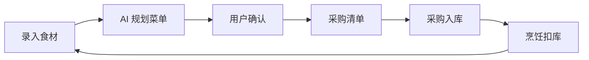
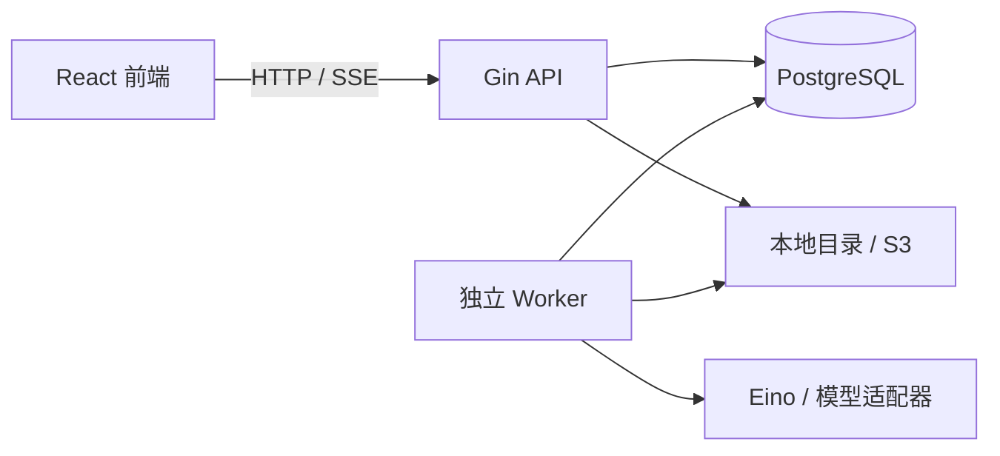

# FoodFlow 食光

**好好吃饭，少一点浪费。**

FoodFlow 是一个面向个人与家庭的食材管理与 AI 膳食规划平台，将库存、菜单、采购和烹饪消耗串联起来。



## 核心功能

| 模块 | 功能 |
| --- | --- |
| 账号与家庭 | 手机号 / 邮箱密码登录、JWT 会话、成员邀请与角色权限 |
| 食材库存 | 图文选择、名称与别名搜索、多批次、临期提醒、报损与纠偏 |
| 菜谱推荐 | 原料覆盖匹配、缺料分析、多菜组合与原料冲突检测 |
| 营养规划 | 营养参考、库存搭配建议、异步菜单生成与人工确认 |
| 共享采购 | 协同清单、采购项删除、幂等入库与安全库存补货 |
| 烹饪打卡 | 按餐次确认、优先扣减临期批次、完整库存流水 |
| 官方价格 | 37 城市选择，展示官方监测价格、规格、来源与日期 |

食材目录包含 **91 种食材**，其中 **79 种**提供 USDA SR Legacy 营养参考值，按每 100 克可食部展示。

## 技术架构

| 层次 | 技术 |
| --- | --- |
| 前端 | React、TypeScript、Vite、Tailwind CSS、Radix |
| 状态管理 | TanStack Query、Zustand |
| 后端 | Go、Gin、OpenAPI |
| 数据层 | PostgreSQL、pgx、sqlc、goose |
| Agent | Eino、Chat Completions 兼容适配器、结构化输出校验 |
| 存储与部署 | 本地目录 / S3、Docker Compose、GitHub Actions |
| 测试 | Go testing、Testcontainers、Vitest |



### 工程设计

- **库存一致性**：事务、行锁、条件更新和非负约束防止超扣；幂等键校验请求摘要，防止重复入库与扣减。
- **精确计量**：数量精度为 0.001；仅在同一维度内换算，份数缩放向上舍入。跨批次扣库按最早到期优先（FEFO），纠偏通过补偿流水完成。
- **内存调度**：多字位集、`math/bits`、到期小顶堆和有界组合搜索，共享原料余额以检测多菜资源冲突。
- **Agent 边界**：模型提出方案，服务端校验权限、菜谱和数量；用户确认后才执行业务写入，执行时重新检查库存。
- **任务恢复**：PostgreSQL 队列通过 `FOR UPDATE SKIP LOCKED` 领取任务，租约与取消状态控制结果写入；模型调用失败后手动重试。
- **状态同步**：SSE 推送业务变更，断线后重新读取服务端状态。
- **身份认证**：JWT 配合服务端会话撤销；验证码采用 HMAC、用途隔离、限流和单次消费。

## 启动与配置

> 当前 GitHub 仓库仅包含项目说明；以下命令适用于完整源码。

开发环境：Go 1.26、Node.js 24、pnpm 11、Docker Compose。

### Docker Compose

1. 复制配置文件：

   ```bash
   cp .env.example .env
   ```

2. 在 `.env` 中设置至少 32 字节的随机 `JWT_SECRET`，可用以下命令生成：

   ```bash
   node -e "console.log(require('crypto').randomBytes(48).toString('base64'))"
   ```

3. 启动服务，自动执行迁移与种子数据导入：

   ```bash
   docker compose up --build -d
   docker compose ps
   ```

| 服务 | 地址 |
| --- | --- |
| 前端 | `http://localhost:5173` |
| API | `http://localhost:8080/api` |
| 健康检查 | `/health/live`、`/health/ready`（API 服务） |
| 指标 | `http://localhost:8080/metrics` |

### 可选集成

| 配置 | 说明 |
| --- | --- |
| `MODEL_ENDPOINT`、`MODEL_NAME`、`MODEL_API_KEY` | 文字模型；未配置时显示演示模式 |
| `VISION_MODEL_NAME` | 视觉模型，可单独配置端点与密钥 |
| `SMS_PROVIDER=aliyun` | 需 AccessKey、已审核签名及验证码模板 |
| `STORAGE_BACKEND` | `local` 或 `s3`；S3 需配置端点、区域、桶和凭证 |
| `MARKET_PRICE_SYNC=true` | Worker 启动及每 6 小时同步官方价格 |

API 与 Worker 共用配置，环境变量优先于 `.env`；修改后需重启。短信未配置时可使用邮箱注册与密码登录。

## 测试

```bash
go test ./...
go vet ./...
cd web
pnpm test
pnpm build
```

Testcontainers 依赖 Docker；请检查集成测试是否被跳过。`TEST_DATABASE_URL` 必须指向专用测试数据库。

截至 2026-09-26，已通过库存并发与幂等、家庭权限隔离、单位与份数计算、Worker 恢复与取消、JWT 和短信协议测试，以及前端测试和生产构建。DeepSeek 菜单、营养建议与图片识别已完成真实接口检查。

## 部署与维护

- 生产环境启用 HTTPS，密钥通过部署平台管理，不提交 `.env`、运行数据和日志。
- 升级前使用 `pg_dump` 备份数据库，图片目录或 S3 对象单独备份；恢复到空目标数据库。
- 任务排队时检查 Worker 和数据库连接；模型鉴权失败时检查密钥、端点及环境变量覆盖。

## 当前边界

- 营养数据为参考值；缺少重量换算依据时不计算整餐摄入量。重要忌口需人工核对。
- 图片识别提供一种主要食材建议，入库前需确认；尚未评测识别准确率。
- 多菜耗时按各菜耗时相加；安全库存补货目前仅在烹饪扣库后触发。
- 官方价格覆盖日监测及月均数据，部分城市、食材没有当天报价。
- 真实短信送达、S3 与完整 Compose 部署尚未完成端到端验证。
- 手机号换绑、邮箱绑定、账号合并及短信找回密码尚未实现。

## 许可证

尚未指定开源许可证。
