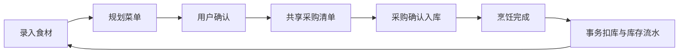
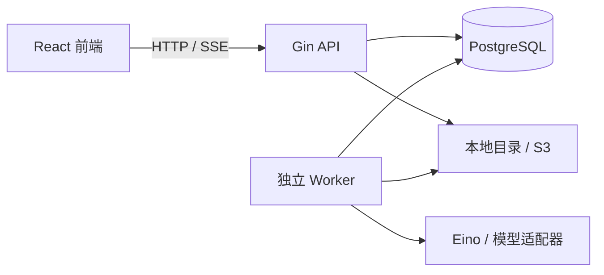

# FoodFlow 食光

**家庭食材管理与 AI 膳食规划平台**

FoodFlow 面向个人与家庭，围绕食材库存、菜单规划、共享采购和烹饪消耗构建完整业务流程。项目采用 Go 模块化单体 API 与独立 Worker；模型负责提供建议，权限、数量计算、单位换算及库存写入由确定性业务代码执行。

> 项目持续开发中。本文描述当前本地实现；本次 GitHub 仓库先发布项目说明，源代码尚未上传。下述路径和启动命令对应本地完整项目。

## 1. 项目目标

- 管理家庭食材及其批次、数量、位置与有效期。
- 根据真实库存和家庭偏好生成可确认的菜单建议。
- 协同采购和做饭，减少重复采购与库存记录偏差。
- 通过事务、幂等和任务恢复机制保证关键业务正确性。



## 2. 功能概览

| 模块 | 当前能力 |
| --- | --- |
| 账号与家庭 | 手机号或邮箱统一密码登录、JWT 会话、家庭创建、邮箱邀请、成员角色与家庭权限隔离 |
| 短信认证 | 验证码注册、登录及手机号绑定；阿里云适配器已实现，真实短信待配置验证 |
| 食材库存 | 图文目录、Trie 名称与别名搜索、多批次、实拍照片、临期提醒、报损、纠偏和追加式流水 |
| 菜谱调度 | 自编示例菜谱、原料覆盖匹配、缺料分析、多菜组合及共享原料冲突检测 |
| 营养规划 | 可追溯营养参考资料、所选库存搭配建议、异步菜单生成、人工确认与任务取消 |
| 采购烹饪 | 共享清单、采购项软删除、幂等入库、跨批次 FEFO 扣减和安全库存补货 |
| 官方价格 | 37 城市选择，官方日监测或月均价格，保留来源、规格和监测日期 |
| 用户界面 | 顶部导航、昵称头像与个人中心、图片上传预览、任务进度、取消动画及 SSE 同步 |

食材目录包含 **91 种食材**，其中 **79 种**有经过映射核对的 USDA SR Legacy 营养参考值，其余保留未知说明。参考值按每 100 克可食部展示，不等同于当前批次检测结果或整餐摄入量。

## 3. 技术架构

| 层次 | 技术选型 |
| --- | --- |
| 前端 | React、TypeScript、Vite、Tailwind CSS、Radix/shadcn 风格组件 |
| 状态管理 | TanStack Query、Zustand |
| API | Go 1.26、Gin、OpenAPI |
| 数据层 | PostgreSQL、pgx、sqlc、goose |
| Agent | Eino 模型接口、Chat Completions 兼容适配器、结构化输出校验 |
| 后台任务 | PostgreSQL 持久队列、独立 Go Worker、租约与令牌校验 |
| 存储与交付 | 本地目录 / S3 兼容接口、Docker Compose、GitHub Actions |
| 测试 | Go testing、Testcontainers、Vitest、HTTP 主流程脚本 |



采用模块化单体以降低个人维护与部署成本。任务由独立 Worker 执行；首版不依赖 Redis、消息中间件或向量数据库。

## 4. 核心工程设计

### 4.1 数据一致性

- 数量 API 使用最多三位小数的字符串，数据库保存千分之一基本单位的整数；份数缩放向上舍入至 0.001。
- 质量仅在 g/kg、体积仅在 ml/l 内换算；计数单位须相同，不推测“个”和“克”的关系。
- 库存扣减采用事务、批次行锁、条件更新及非负约束；不足时整体回滚。
- 自动扣库优先最早到期批次（FEFO），同到期日再按购买日期等次序分配，排除过期或变质批次。
- 幂等键同时校验请求摘要；采购状态及家庭、日期、餐次唯一约束防止重复入库和重复扣减。
- 库存纠正通过补偿流水完成；采购项删除不删除已入库批次和历史流水。

### 4.2 算法与 Agent 边界

- 纯内存算法使用多字位集、`math/bits`、到期小顶堆与有界组合搜索。
- 多菜方案共享原料余额，检测资源争抢；推荐时不预留库存，实际执行重新校验。
- 模型仅访问受家庭权限约束的业务上下文，不执行 SQL 或任意命令。
- 菜谱 ID 与结构化响应由服务端校验；生成建议或草案不直接扣库存。
- 一个任务最多一次模型调用。请求超时 25 秒、任务执行超时 35 秒；文字输出预算 1,600 tokens，图片识别 400 tokens。

### 4.3 任务与会话

- Worker 通过 `FOR UPDATE SKIP LOCKED` 安全领取任务，定期续租；结果写入必须匹配有效租约与取消状态。
- 可能收费的模型调用失败或租约失效后要求手动重试，不声称外部服务具备 exactly-once 保证。
- SSE 断线后重新读取 API，数据库是最终事实来源。
- JWT 使用 HS256，有效期 7 天；数据库保存令牌哈希，退出时撤销。家庭角色始终查询数据库。
- 验证码保存 HMAC，5 分钟有效、最多 5 次错误、单次使用，并隔离注册、登录与绑定用途。

## 5. 启动与配置

以下步骤适用于本地完整源码；仅下载当前说明文件无法运行应用。

### 5.1 环境要求

Go 1.26、Node.js 24、pnpm 11、Docker Compose，以及可访问镜像和依赖仓库的网络。

### 5.2 Docker Compose

```bash
cp .env.example .env
```

编辑 `.env`，填写至少 32 字节的随机 `JWT_SECRET`。可使用下列命令生成，并仅将结果保存到本机配置：

```bash
node -e "console.log(require('crypto').randomBytes(48).toString('base64'))"
docker compose up --build -d
docker compose ps
```

| 服务 | 本地地址 |
| --- | --- |
| 前端 | `http://localhost:5173` |
| API | `http://localhost:8080/api` |
| 存活检查 | `http://localhost:8080/health/live` |
| 就绪检查 | `http://localhost:8080/health/ready` |
| 基础指标 | `http://localhost:8080/metrics` |

迁移服务自动执行数据库迁移与种子数据导入。API 和 Worker 启动时读取工作目录的 `.env`，已有环境变量优先；修改配置后重启两个服务。

### 5.3 外部服务

| 配置 | 说明 |
| --- | --- |
| `JWT_SECRET` | 必填，API 与 Worker 共用，不得复用其他服务密钥 |
| `MODEL_ENDPOINT`、`MODEL_NAME`、`MODEL_API_KEY` | 文字模型配置，缺失时明确显示演示模式 |
| `VISION_MODEL_NAME` | 视觉模型名称；可用独立视觉端点与密钥覆盖共享配置 |
| `SMS_PROVIDER` | 配置为 `aliyun`，还需 AccessKey、已审核签名及验证码模板 |
| `STORAGE_BACKEND` | `local` 或 `s3`；S3 需配置端点、区域、桶和访问凭证 |
| `MARKET_PRICE_SYNC` | 为 `true` 时，Worker 启动及每 6 小时同步官方公开价格 |

DeepSeek 参考配置：

```dotenv
MODEL_ENDPOINT=https://api.deepseek.com
MODEL_NAME=deepseek-flash
MODEL_API_KEY=
VISION_MODEL_NAME=deepseek-flash
```

短信未开通时，获取验证码按钮禁用，不提供假验证码；可使用邮箱注册和密码登录。已有邮箱账号验证绑定手机号后，两种标识共用同一账号密码，不按密码相同合并不同账号。

## 6. 测试与验证

```bash
go test ./...
go vet ./...
cd web
pnpm test
pnpm build
```

Testcontainers 需要可用 Docker。Docker 不可用时部分测试会跳过，应检查 `go test ./internal/app -v` 输出。`TEST_DATABASE_URL` 只能指向专用测试数据库，不能指向实际家庭数据。

| 验证范围 | 状态（截至 2026-09-26） |
| --- | --- |
| 并发扣减、幂等入库、跨家庭访问、单位约束、人数缩放 | PostgreSQL 集成测试通过 |
| Worker 租约恢复、旧 Worker 写入阻止、取消后不写库存 | 自动化测试通过 |
| JWT 签名、过期、退出撤销、统一账号登录 | 自动化测试通过 |
| 短信用途隔离、错误次数、过期、重放及手机号绑定 | 测试发送器集成测试通过，未发送真实短信 |
| 阿里云请求参数、签名及失败处理 | 本地协议测试通过 |
| DeepSeek 菜单、营养建议、图片识别 | 合成内容的真实接口检查通过，未评测识别准确率 |
| TypeScript、Vitest、前端生产构建 | 通过，不等同于全页面端到端覆盖 |
| S3、完整 Compose 镜像部署 | 尚未端到端验证 |

项目不声明未经测量的用户规模、吞吐量或业务效果。内存算法 Benchmark 不等同于 HTTP 端到端延迟。

## 7. 部署与维护

- 当前数据库迁移编号为 `020`；升级前备份数据库及图片，再执行待运行迁移。
- 生产部署使用 HTTPS、强数据库密码和部署平台机密管理。
- 备份通过 `pg_dump` 完成，仅在已确认的空目标数据库中恢复；图片目录或 S3 对象需单独备份。
- 定期清理过期会话、验证码挑战、限流窗口与按保留策略归档的任务记录。
- 不提交 `.env`、`.cache`、`data`、数据库备份、运行日志或含个人资料的截图。

| 问题 | 检查方向 |
| --- | --- |
| API 启动失败 | JWT 密钥长度、数据库连接、迁移状态 |
| 任务长期排队 | Worker 是否启动并连接同一数据库 |
| 模型返回 401 | API 密钥、端点、环境变量覆盖情况 |
| 短信按钮不可用 | 服务商、凭证、签名及模板是否配置并重启服务 |
| 入库或烹饪返回 409 | 库存、采购状态、菜单版本及计量单位 |
| 城市无今日价格 | 数据源可能仅有月均或历史记录，不应改写为今日价格 |

## 8. 项目结构

```text
cmd/                 API、Worker、迁移、价格同步与模型检查入口
internal/app/        HTTP、鉴权、事务业务与任务执行
internal/agent/      模型适配及结构化响应校验
internal/engine/     位集匹配与多菜调度算法
internal/nutrition/  可追溯食材营养资料
internal/market/     官方价格同步与解析
internal/sms/        短信接口与阿里云适配器
internal/storage/    本地目录与 S3 存储接口
sql/                 goose 迁移与 sqlc 查询
web/                 React 前端
tests/               HTTP 主流程脚本
```

## 9. 已知限制

- 部分食材没有可核验的精确营养数值，不推测缺乏换算依据的整餐摄入量。
- 图片识别目前只建议一种主要食材，最终入库必须人工核对。
- 自由文本偏好没有完整的过敏原语义解析，重要忌口需用户核对菜谱。
- 多菜时间按各菜耗时相加，不估算并行烹饪；搜索达到预算会显示截断。
- 安全库存补货在实际烹饪扣库后触发，其他库存修改暂不触发。
- 官方价格不具备全部城市、全部食材的每日覆盖；社区成交价功能已下线。
- 提醒为应用内提醒；头像为昵称首字，尚未提供个人照片上传。
- 手机号换绑、邮箱绑定、账号合并、短信找回密码和真实短信送达验证尚未完成。

## 10. 使用与分发

项目尚未附带开源许可证，源码使用与分发权限由项目所有者另行明确。真实模型与短信调用可能产生费用，启用前应检查服务配置和账户额度。
