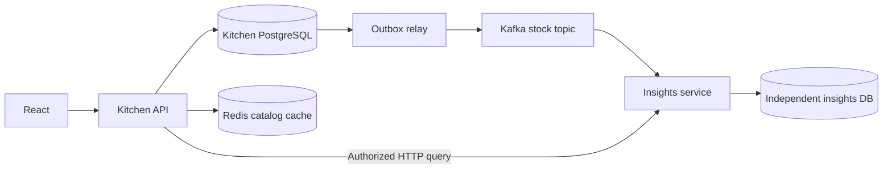

# Service ownership and event delivery



The API owns users, permissions, inventory, procurement, menus and authoritative writes. Model Worker keeps its existing PostgreSQL queue and lease fencing. Insights is a separate executable and database owner; its only kitchen input is the versioned stock event. API checks current household membership before forwarding a request authenticated with an internal service token. Statistics cannot mutate inventory.

Redis caches the public catalog for 60 seconds after authentication. Keys contain no household data. Reads/writes use short deadlines, no retry storm, and database fallback. Inventory balance, permissions and idempotency remain authoritative in PostgreSQL. Cache metrics are on API `/metrics`; catalog responses expose `X-Catalog-Cache`. Catalog updates can be stale for one TTL.

Migration 028 creates outbox events in the same transaction as the immutable ledger, after its historical snapshot trigger. Existing snapshot-backed rows are initialized with their original facts; older rows without snapshots are not invented. Relay holds an outbox row lock through bounded broker acknowledgement, then marks it published. A crash between broker acknowledgement and DB commit may republish the same ID. Broker outage queues events while core writes continue.

Kafka topic `foodflow.stock.v1` partitions by household ID. Consumers validate schema and signs; they insert a fact with a unique event ID in their local transaction and commit Kafka offsets afterward. Duplicates do not count twice; conflicting IDs or malformed payloads are quarantined with a digest and Kafka coordinates. Logs avoid message bodies and credentials. Quarantine investigation and replay require an operator; automatic mutation of rejected payloads is not provided.

Monthly quantities group by ingredient and exact unit; grams, milliliters and counts are never summed into an invented total. Query windows use the household timezone. Projection is eventually consistent and displays last receipt time; this timestamp alone is not an exact measure of consumer lag. This release reports quantities, not nutrition, cost savings or a complete monthly waste bill.

## Local deployment

```powershell
pwsh -File scripts/local-acceptance.ps1 up
pwsh -File scripts/platform-acceptance.ps1
```

The second script enables `compose.platform.yaml` over the isolated acceptance stack. Redis and Kafka bind no host ports; service traffic stays on its network. Insights has a separate PostgreSQL database/container and secret; volumes persist independently. The main development Compose remains usable without these components. The application is available at `http://127.0.0.1:15173`.

Local single-node Kafka uses KRaft without ZooKeeper, one replica and plaintext internal traffic. Production requires replication, SASL/TLS, Redis ACL/TLS, managed secrets, network isolation, alerts for outbox age/consumer lag/quarantine, retention and backup policies. Keeping the two databases on distinct containers demonstrates ownership; it is not a claim of production high availability.

## Diagnosis and recovery

Use the same `--env-file .cache/acceptance.env -f compose.acceptance.yaml -f compose.platform.yaml` arguments for Compose diagnostics. `exec db psql -U foodflow -d foodflow` can inspect `stock_outbox` pending count, oldest `created_at`, retry time and attempts; inspect `rejected_events` in `insights-db` for poison message coordinates. `exec kafka /opt/kafka/bin/kafka-consumer-groups.sh --bootstrap-server kafka:9092 --describe --group foodflow-insights-v1` shows committed offsets and lag.

Back up the kitchen database and image objects as before; additionally back up the insights database with `pg_dump -U insights -d insights -Fc` into a protected local file. Recovery must target a fresh database before comparing counts and projections. Kafka volume is not a substitute for PostgreSQL backups. If the projection needs a full rebuild beyond Kafka retention, retained snapshot-backed outbox payloads are the replay source: pause relay, prepare a fresh projection, explicitly reset selected outbox publication markers, then resume relay and verify convergence. This administrative operation is deliberately not exposed as a user API. Replaying into an existing projection is safe against identical IDs, but a missing historical snapshot cannot be reconstructed from today's ingredient values.
